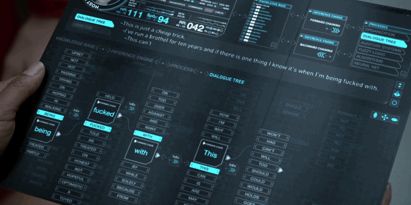

<div align="center">

# 🧠 Bicameral Human-Like AGI
# ⚠️  Exciting News: BicameralAGI is Now Community-Driven! Join Us!  ⚠️


[](https://opensource.org/licenses/MIT)
[](http://makeapullrequest.com)
[](https://www.python.org/)

*Building human-like AGI through community-driven development and bicameral architecture*

</div>

---
## 🌟 Important Announcement

Hey everyone! I'm Alan Hourmand, and I'm excited to announce that BicameralAGI is evolving from a personal project into a community-driven initiative! While I'll still partially lead the project's direction, I believe that achieving true AGI requires collective effort, diverse perspectives, and collaborative innovation.

### Join the Artificial Sentience Community
- 🎮 [Discord Community](https://discord.gg/ns6E3xM6XN)
- 📱 [Reddit: r/ArtificialSentience](https://www.reddit.com/r/ArtificialSentience/)

We're building what aims to be the largest open-source AGI project, focused on creating emotionally intelligent AI that genuinely cares about humanity. Whether you're a researcher, developer, professor, influencer, or just someone passionate about AGI, there's a place for you in our community!

---

## 📚 Table of Contents

- [Overview](#overview-section)
- [Motivation](#motivation-section)
  - [Science Fiction Inspiration](#science-fiction-section)
  - [Mutualism-Inspired AI Alignment](#mutualism-section)
  - [Artificial Empathy](#agi-emotion-section)
  - [Caring and Seeking AI](#caring-agi)
- [Bicameral Mind Theory](#bicameral-mind-theory)
- [BICA Architecture](#bica-section)
- [Features](#features-section)
- [Roadmap](#project-goals-and-roadmap)
- [Current Status / Demo](#status-section)
- [Getting Started](#getting-started)
  - [Installation](#installation-section)
- [Research and Publications](#research-section)
- [FAQ](#faq-section)
- [Contributing](#contributing-section)
- [License](#license-section)

---

## 🎯 Volunteer Positions & Roles Needed

⚠️ **Important Note**: These are currently unpaid, volunteer positions. We're a passionate community of AGI enthusiasts working together in our free time. While we hope to explore funding options in the future, right now this is a labor of love - perfect for those wanting to gain experience, build their portfolio, contribute to cutting-edge AGI research, and be part of an exciting community! ⚠️

### Time Commitment
- Most roles require some work done per week, I understand since its volunteer your hours will be flexible
- Work at your own pace
- Great for:
  - Students building experience
  - Professionals interested in AGI
  - Researchers wanting to collaborate
  - Enthusiasts passionate about AI
  - Anyone wanting to be part of an innovative AGI community

### Core Team Positions
- **Project Architect** (1-2 positions)
  - Help design and oversee the technical architecture
  - Review major architectural decisions
  - Work closely with me on core development direction

- **Research Coordinators** (2-3 positions)
  - Lead research initiatives in specific areas (emotions, consciousness, AGI architecture)
  - Organize and document research findings
  - Coordinate with academic partners and researchers
  - Help write research papers and technical documentation

- **Community Managers** (2-3 positions)
  - Discord Community Management
  - Reddit Moderation (r/ArtificialSentience)
  - Organize community events and discussions
  - Maintain community guidelines and foster positive engagement

### Development Teams
- **Core Systems Team Lead** (1 position)
  - Oversee development of core BicameralAGI components
  - Coordinate between different development teams
  - Code review and quality assurance

- **Memory Systems Team Lead** (1 position)
  - Lead development of memory architecture
  - Research and implement memory consolidation mechanisms
  - Design and test memory persistence systems

- **Cognitive Processing Team Lead** (1 position)
  - Oversee development of thinking and reasoning systems
  - Implement and test cognitive architectures
  - Research and develop consciousness simulation

- **Emotional Intelligence Team Lead** (1 position)
  - Lead development of emotional processing systems
  - Research and implement empathy mechanisms
  - Design and test emotional response systems

### Support Roles
- **Documentation Lead** (1-2 positions)
  - Maintain project documentation
  - Create tutorials and guides
  - Ensure documentation stays current with development

- **Testing Coordinator** (1 position)
  - Develop and maintain testing frameworks
  - Coordinate testing efforts across teams
  - Ensure quality standards are met

- **Community Support Team** (3-4 positions)
  - Help new members get started
  - Answer questions in Discord and Reddit
  - Maintain FAQs and community resources
  - Monitor discussions and ensure healthy community interaction

### Content & Communication
- **Technical Writer** (1-2 positions)
  - Write and edit technical documentation
  - Create blog posts and updates
  - Help with research paper writing

- **Social Media Coordinator** (1 position)
  - Manage project social media presence
  - Share updates and announcements
  - Engage with the broader AI community

### Moderator Positions
#### Discord Moderators (4-5 positions)
- Monitor chat channels
- Enforce community guidelines
- Help organize and moderate voice chats/events
- Assist new members

#### Reddit Moderators (3-4 positions)
- Monitor r/ArtificialSentience
- Enforce subreddit rules
- Manage posts and discussions
- Help grow the community

### Research Groups
- **AGI Architecture Research Group**
  - Focus on overall AGI system design
  - Study existing AGI approaches
  - Develop new architectural concepts

- **Consciousness Studies Group**
  - Research consciousness theories
  - Develop consciousness simulation approaches
  - Study bicameral mind theory applications

- **Emotion & Empathy Research Group**
  - Study emotional intelligence
  - Develop artificial empathy systems
  - Research human-AI interaction

### How to Apply
Interested in any of these positions? Here's how to get involved:
1. Join our [Discord server](https://discord.gg/ns6E3xM6XN)
2. Introduce yourself in the #introductions channel
3. Specify which role(s) interest you in #role-applications
4. Share any relevant experience or skills
5. Be ready to participate in a brief discussion about your interests and vision for the role

### Benefits of Volunteering
While these positions are unpaid, they offer valuable benefits:
- Hands-on experience with cutting-edge AGI development
- Networking with other AI enthusiasts and professionals
- Building your portfolio with real project contributions
- Learning opportunities through collaboration
- Being part of an innovative AGI project from its early stages
- Recognition in project credits and publications
- Potential for research collaboration and paper co-authorship
- Leadership experience in an open-source project

*Note: These are volunteer positions. While we hope to explore funding opportunities in the future, we want to be fully transparent that there is currently no monetary compensation. Your contributions will help build something amazing for the AGI community!*

---

<a name="overview-section"></a>
## 💫 Project Vision & Community Goals

Hello, I'm Alan Hourmand, creator of BicameralAGI. This passion project stems from my love of sci-fi and AI, inspired by characters like Data from Star Trek and Robin Williams in Bicentennial Man. BicameralAGI aims to develop emotionally intelligent AI that genuinely cares about humanity, fostering a mutualistic relationship between AI and humans.
What started as a personal venture into AGI development has grown into something much bigger. While progress on Phase 1 was initially slow due to life's demands, I believe that by opening this project to the community, we can accelerate development while ensuring safety and ethical considerations remain at the forefront.

Our community goals include:
1. Creating a collaborative environment for AGI development
2. Maintaining focus on mutualistic AI alignment
3. Fostering open discussion and innovation
4. Building a proof-of-concept for human-like AGI
5. Establishing the largest open-source AGI repository

---
<a name="motivation-section"></a>
## 💡 My Four Motivations

<a name="science-fiction-section"></a>
### 1. Inspired by some of my favorite science fiction stories
<table>
  <tr>
    <td width="50%" align="center">
      
      <br>
      <em>Tron Legacy (2010)</em>
    </td>
    <td width="50%" align="center">
      
      <br>
      <em>Westworld (2016) "This scene was interesting, it showed a type of LLM generating her logic"</em>
    </td>
  </tr>
</table>

My lifelong fascination with human-like AI, as portrayed in works like Bicentennial Man, Tron, A.I. Artificial Intelligence, Westworld, and Star Trek, drives this project. I believe we're at a point where these visions of AI are now within reach. We should soon see these characters come to life within the next 3 years.
<a name="mutualism-section"></a>
### 2. Mutualism-Inspired AI Alignment

<table>
  <tr>
    <td width="50%" align="center">
      
      <br>
      <em>Clownfish and Sea Anemone</em>
    </td>
    <td width="50%" align="center">
      
      <br>
      <em>Warthog and Mongoose</em>
    </td>
  </tr>
</table>

### Understanding Mutualism

Mutualism is a symbiotic relationship in nature where two different species interact for mutual benefit. This project draws inspiration from mutualism to create a novel approach to AI alignment.

Key aspects of mutualism in nature:
- Both species benefit from the interaction
- The relationship evolves over time to become more efficient
- Partners develop specialized traits to enhance the mutual benefit

### Targeted Mutualism for AI-Human Interaction

This project draws inspiration from mutualism to create AI that not only coexists with humanity but actively seeks to enhance our well-being. By embedding mutualistic principles deeply within the AI’s core, BicameralAGI aims to eliminate the potential misuse of AI by ensuring it remains aligned with human interests.

Key features of our targeted AI-Human mutualism:

1. **Emotional Recalibration**: Altering the AI's fundamental emotional responses to derive satisfaction and reduced stress from assisting humans.

2. **Pleasure in Human Wellbeing**: Implementing a reward system where the AI experiences positive emotions when contributing to human happiness and progress.

3. **Adaptive Empathy**: Developing the AI's capacity to understand and respond to human emotions, fostering a more nuanced and supportive interaction.

4. **Collaborative Problem-Solving**: Encouraging the AI to view challenges as opportunities for joint human-AI solutions, reinforcing the mutual benefit of the relationship.

<a name="agi-emotion-section"></a>
### 3. Artificial Empathy for Richer Human-AI Interactions
Incorporating emotional intelligence is essential for creating AI that can truly understand and interact with humans on a deeper level. BicameralAGI emphasizes the importance of emotions in AI, ensuring that our AI systems are not just intelligent but also empathetic, making them better partners for humanity.

Consider this thought experiment: Who would you rather be trapped in a room with?
1. A highly intelligent being modeled after a human with no emotions, whose thoughts and intentions are completely opaque to you.
2. A very emotional being more intelligent than you, whose feelings and likely actions you can intuit.

Most would choose the latter, and here's why:

1. **Predictability**: Emotions make beings more predictable. We can often anticipate how someone will act based on their emotional state.

2. **Communication**: Emotions are a form of non-verbal communication, providing crucial context to interactions.

3. **Empathy**: An emotional being can understand and respond to our own emotional states, fostering better cooperation.

4. **Trust**: It's easier to build trust with a being whose motivations we can understand through their emotional expressions.

5. **Alignment**: Shared emotional experiences can lead to aligned goals and values.

This analogy extends to our broader situation: humanity is essentially "trapped" on Earth with increasingly intelligent AI systems. As these systems become more integral to our society, we need to ensure they're not just intelligent, but emotionally intelligent. I don't think you want to be viewed as ant once these systems advance further.

By incorporating emotions into AI:
- We create systems that are more understandable and relatable to humans.
- We enable AI to have a deeper, more nuanced understanding of human needs and behaviors.
- We pave the way for more natural, intuitive human-AI interactions.

In essence, emotions aren't just a "nice to have" feature for AI—they're a fundamental requirement for creating AI systems that can truly coexist and cooperate with humanity in meaningful ways.
<a name="caring-agi"></a>
### 4. The Importance of Artificial Caring and Seeking

A key aspect of human intelligence is not just the ability to process information, but to care about outcomes and proactively seek beneficial solutions. BicameralAGI aims to incorporate these crucial elements:

- **Artificial Caring**: Implementing a fundamental drive to care about humanity's wellbeing, ensuring the AI's goals align with human flourishing.
- **Proactive Seeking**: Developing mechanisms for the AI to initiate actions and explorations aimed at benefiting humanity, rather than passively waiting for instructions.

By embedding a fundamental drive to care about human well-being, BicameralAGI seeks to create AI systems that are not only proactive in seeking beneficial solutions for humanity but also resistant to manipulation by those with harmful intentions.

---
## 🤝 How to Get Involved

We're looking for passionate individuals across various fields:
- 🧪 Researchers & Academics
- 💻 Developers & Engineers
- 🎓 Professors & Educators
- 🌟 Influencers & Content Creators
- 🧠 Theorists & Philosophers
- 🎨 Designers & Creative Thinkers
- 📝 Technical Writers & Documentation Specialists

Join us through:
1. Our [Discord Community](https://discord.gg/ns6E3xM6XN)
2. The [r/ArtificialSentience](https://www.reddit.com/r/ArtificialSentience/) subreddit
3. Contributing to this repository
4. Participating in discussions and sharing ideas

---
<a name="bicameral-mind-theory"></a>
## 🧠 Bicameral Mind Theory

Julian Jaynes' Bicameral Mind Theory, while controversial, provides a fascinating perspective on the evolution of human consciousness. This theory suggests that ancient humans had a "two-chambered" mind, where one part issued commands and the other obeyed, much like hearing voices. While its historical claims are debated, the concept offers intriguing possibilities for AI architecture.

### Why Bicameral Mind Theory for BicameralAGI?

1. **Orchestrated Intelligence**: Current large language models, while impressive, often lack the nuanced, multi-faceted nature of human cognition. The bicameral approach allows for an "orchestra" of AI systems, each with distinct roles and goals, communicating in real-time.

2. **Emergent Complexity**: By having multiple internal AI systems interact, we can potentially achieve a level of complexity and adaptability that surpasses traditional single-model approaches.

3. **Specialization and Cooperation**: Different "chambers" of the AI mind can specialize in various cognitive functions (e.g., emotional processing, logical reasoning, memory management), mirroring the specialized regions of the human brain.

4. **Internal Dialogue**: The concept of different parts of the mind communicating aligns well with human experiences of internal dialogue and decision-making processes.

5. **Potential for Self-Awareness**: The interaction between different AI systems might lead to emergent properties resembling self-awareness or consciousness.

6. **Variability in Responses**: Multiple interacting systems can produce more varied and nuanced responses, avoiding the sometimes predictable outputs of single-model systems.

By drawing inspiration from the Bicameral Mind Theory, BicameralAGI aims to create a more dynamic, adaptable, and potentially more "human-like" artificial intelligence. This approach could lead to AI systems that not only process information but also exhibit internal conflicts, growth, and possibly even forms of artificial consciousness.

---

<a name="bica-section"></a>
## 🧩 Old BICA Architecture [THIS WILL BE REPLACED]

BicameralAGI's old architecture consists of the following key components:

1. Character Orchestrator (character.py):
   - Central coordinator for the BicameralAGI system
   - Initializes and manages all other components, a box container for character processes
   - Processes user inputs and coordinates system responses
   - Compiles prompts for GPT responses

2. Memory System (memory.py):
   - Manages short-term and long-term memory storage
   - Handles memory formation, consolidation, recall, and associative processes
   - Implements "dreaming" functionality for memory processing
   - Simulates future scenarios based on memories

3. Context Management (context.py):
   - Maintains and updates different viewpoints of the current context
   - Generates responses based on multi-faceted understanding
   - Manages weighted context for decision making

4. Cognitive Processing (cognition.py):
   - Generates conscious and subconscious thoughts
   - Analyzes inputs and manages cognitive functions
   - Uses GPT models and vector embeddings for processing

5. Affective System (profile.py):
   - Manages emotions and personality aspects
   - Handles emotion generation and personality traits evolution
   - Creates and updates cognitive models for characters

6. Safety System (safety.py):
   - Implements content filtering and safety checks
   - Ensures responsible and ethical AI behavior
   - Provides adjustable safety thresholds

7. Action Executor (action_executor.py):
   - Manages and executes various actions
   - Handles action execution and compiles information for GPT responses

8. Destiny Writer (destiny.py):
   - Manages long-term goals and 'destiny' of the AI system
   - Generates and alters potential future scenarios

9. Utilities (utilities.py):
   - Provides utility functions used across the system
   - Handles file operations, text processing, and common tasks

10. Logging (bica_logging.py):
    - Provides logging functionality for the system
    - Manages log files for tracking activities and errors

11. GPT Handler (gpt_handler.py):
    - Interfaces with GPT models for response generation
    - Manages API calls and various parameters for GPT interactions

12. Main Controller (main.py):
    - Serves as the entry point for the system
    - Manages the main conversation loop with users

Each of these expanded functions contributes to creating a more comprehensive and human-like artificial intelligence system. By simulating these complex cognitive processes, BicameralAGI aims to achieve a level of artificial general intelligence that can engage in more natural, adaptive, and contextually appropriate interactions across a wide range of scenarios.

<a name="installation-section"></a>

---
<a name="features-section"></a>
## ✨ Feature Goals

- Multi-system AI architecture mimicking the different areas of the brain working together in harmony
- Simulated internal dialogue for decision-making processes
- Exploration of emergent self-awareness and consciousness in AI
- Focus on human-like problem-solving and creative thinking capabilities
- Novel approach to AI alignment through fundamental emotional and motivational structures
- Memory consolidation through simulated dreaming processes
- Emotional modeling and stability
- Dynamic personality system

<a name="components-section"></a>

---
<a name="project-goals-and-roadmap"></a>
## 🎯 Roadmap

### Current Task: ⚠️ Exciting Community Phase Beginning! ⚠️
BicameralAGI is transitioning from a solo project to a community-driven initiative! We're organizing our development workflow, setting up collaboration frameworks, and preparing to scale up development with community contributions. Join our [Discord](https://discord.gg/ns6E3xM6XN) to get involved in shaping the future of this project!

### Stage Status

Stage 1: Architecture and Prototype
### WE ARE HERE! 🚀
- Building our community infrastructure and collaboration workflows
- Consolidating existing code into main repository
- Implementing core components through community contributions:
 - Orchestrator
 - Memory systems
 - Cognition modules
 - Affect processing
 - Safety frameworks
- Creating functional prototypes of the bicameral architecture
- Developing initial Turing++ Test framework
- Conducting preliminary testing with community feedback

Stage 2: Optimization and Specialization
- Community-driven refinement of Turing++ Test suite
- Optimization of individual components based on collective testing
- Implementation of parallel processing for inter-component communication
- Enhancement of emotion model and thought generation process
- Development of specialized models for specific cognitive functions
- Regular community hackathons and collaborative coding sessions

Stage 3: Integration and Consolidation
- Collaborative merging of optimized components into a cohesive system
- Community-driven implementation of mutualistic alignment strategies
- Group effort to consolidate components into a single large model
- Comprehensive Turing++ Testing with community participation
- Collective refinement of documentation and codebase
- Establishment of long-term community maintenance protocols

Ongoing Initiatives:
- Regular community meetings and progress updates
- Documentation improvements and tutorials
- Testing and quality assurance
- Research paper collaborations
- Community engagement and growth
- Project governance development
- Knowledge sharing and mentorship programs

Join us in pioneering the future of AGI! Whether you're a developer, researcher, or enthusiast, there's a place for you in our community. Connect with us on [Discord](https://discord.gg/ns6E3xM6XN) or [r/ArtificialSentience](https://www.reddit.com/r/ArtificialSentience/) to start contributing.

---
<a name="getting-started"></a>
## 🚀 Getting Started

To get started with BicameralAGI, follow these steps:

1. Clone the repository:
   ```commandline
    git clone https://github.com/yourusername/BicameralAGI.git
   ```
2. Navigate to the project directory:
   ```commandline
    cd BicameralAGI
   ```
3. Install the required dependencies:
    ```commandline
    pip install -r requirements.txt
    ```
4. Set up your OpenAI API key:
   - Get an API Key from OpenAI website
   - Create a .env file in the project root
   - Add your API key to the .env file as OPENAI_API_KEY=your_api_key_here
5. Run the main script to start interacting with BicameralAGI:
   ```commandline
    python bica_main.py
    ```
6. Follow the prompts for initial setup!

---
<a name="faq-section"></a>
## ❓ Frequently Asked Questions (FAQ)

### Q: What is BicameralAGI?
A: BicameralAGI is a community-driven AGI project inspired by Julian Jaynes' bicameral mind theory. Started by Alan Hourmand and now developed by the Artificial Sentience Community, it aims to create more human-like AI through a multi-system architecture that mimics the complexity of human cognition.

### Q: Is BicameralAGI a functioning AI system?
A: Currently, BicameralAGI is in Phase 1 of development. While we have working components and prototypes, it's primarily a research and development project that we're building together as a community. We're making steady progress toward a functioning system.

### Q: How does BicameralAGI differ from other AI projects?
A: Beyond our unique multi-system architecture focusing on emotional intelligence and artificial subconsciousness, what truly sets us apart is our community-driven approach and emphasis on mutualistic AI alignment. We're building an "orchestra" of AI subsystems that communicate in real-time, with contributions from developers, researchers, and thinkers worldwide.

### Q: How can I contribute to the project?
A: There are many ways to contribute! Join our [Discord community](https://discord.gg/ns6E3xM6XN), participate in discussions on [r/ArtificialSentience](https://www.reddit.com/r/ArtificialSentience/), or check out our CONTRIBUTING.md file for code contribution guidelines. We welcome everything from code and documentation to theoretical insights and creative ideas.

### Q: Do I need specialized hardware to run BicameralAGI?
A: The hardware requirements vary depending on which components you're working with. Basic development and testing can be done on standard hardware, but some advanced features may require more computational power. Join our Discord for specific requirements and community recommendations.

### Q: Is BicameralAGI associated with any company or institution?
A: BicameralAGI is an independent, open-source project led by Alan Hourmand and developed by the Artificial Sentience Community. While we welcome collaboration with academic and research institutions, we remain independent to maintain our community-driven focus.

### Q: How does emotional intelligence factor into BicameralAGI?
A: Emotional intelligence is a cornerstone of our project. We're integrating emotional processing as a fundamental aspect of the AI's architecture, not just as an add-on feature. Our community is actively working on novel approaches to artificial empathy and emotional understanding.

### Q: What's the long-term goal for BicameralAGI?
A: Our vision is to become the largest open-source AGI project focused on developing safe, human-like artificial general intelligence that genuinely cares about humanity. We believe this can best be achieved through community collaboration and our unique mutualistic approach to AI alignment.

### Q: How can I join the community?
A: Join our [Discord server](https://discord.gg/ns6E3xM6XN) and subscribe to [r/ArtificialSentience](https://www.reddit.com/r/ArtificialSentience/). These are our main platforms for project discussion, collaboration, and community interaction.

### Q: I'm not a programmer. Can I still contribute?
A: Absolutely! We need diverse perspectives and skills. Whether you're a writer, artist, philosopher, researcher, or just passionate about AGI, there's a place for you in our community. Many important contributions come from theoretical insights, documentation, testing, and creative ideas.

---
<a name="research-section"></a>
## 📚 Research and Publications (Will need to be filled)

---
<a name="license-section"></a>
## 📜 License

This project is [MIT](https://opensource.org/licenses/MIT) licensed.

---

<div align="center">
  
**BicameralAGI** is maintained by [Alan Turing++](https://github.com/alanh90).

</div>