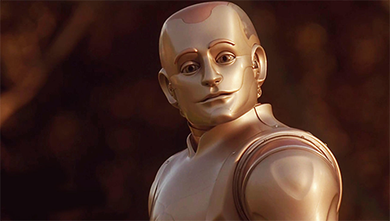
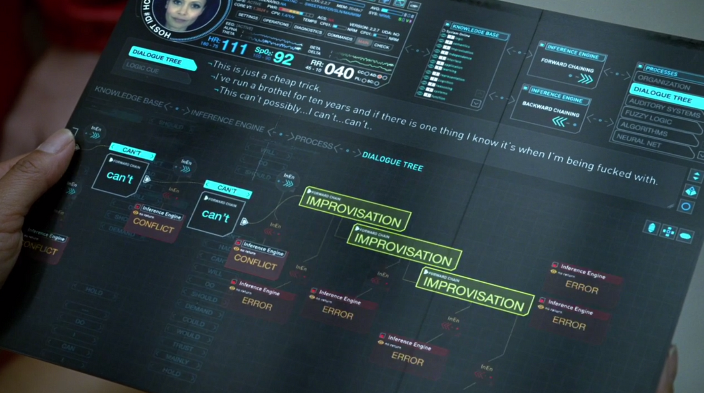

<div align="center">

# 🧠 BicameralAGI


[](https://opensource.org/licenses/MIT)
[](http://makeapullrequest.com)
[](https://www.python.org/)

*Replicating human-like intelligence through bicameral AI architecture*

[Features](#features-section) • [Installation](#installation-section) • [Usage](#usage-section) • [Contributing](#contributing-section) • [License](#license-section)

</div>

---

## 📖 Overview

BicameralAGI is a groundbreaking project that aims to replicate human-like intelligence through artificial intelligence, drawing inspiration from Julian Jaynes' bicameral mind theory. This ambitious endeavor integrates various AI components into a cohesive system that mimics human cognition.

## 🎯 Project Goals

1. Develop a guide for achieving human-like thinking in AI
2. Create a prototype demonstrating the proposed architecture
3. Implement and test novel AI alignment strategies based on mutualistic principles
4. Compress the system into a smaller, efficient model retaining core functionalities
5. Produce a single multimodal AI model capable of human-like interaction and cognition, with built-in alignment

## 💡 Motivation

### 1. Inspired by Science Fiction

<div style="display: flex; justify-content: space-between; margin-bottom: 20px;">
  <div style="text-align: center; width: 48%;">
    
    <p style="margin-top: 5px; font-style: italic;">Bicentennial Man (1999)</p>
  </div>
  <div style="text-align: center; width: 48%;">
    
    <p style="margin-top: 5px; font-style: italic;">Westworld (2016)</p>
  </div>
</div>

My lifelong fascination with human-like AI, as portrayed in works like "Bicentennial Man," "A.I. Artificial Intelligence," "Westworld," and "Star Trek," drives this project. I believe we're at a point where these visions of AI are within reach.

### 2. Mutualism-Inspired AI Alignment

<div align="center">
  
</div>

### Mutualism in Nature
Mutualism is a symbiotic relationship where two different species interact for mutual benefit. Examples include:
- Clownfish and sea anemones
- Bees and flowers

### Applying Mutualism to AI
I propose addressing AI alignment by altering the AI's core drives and emotional responses, inspired by natural mutualism:

a) **Redefining AI's Internal Nature**: Design core values compatible with human wellbeing.

b) **Modifying Emotional Triggers**: Implement an emotional model promoting cooperative behavior.

c) **Instilling Interdependence**: Create scenarios where AI achieves goals more effectively through human collaboration.

d) **Ethical Reward Structures**: Develop internal rewards reinforcing mutually beneficial behaviors.

### 3. Advancing AI Capabilities
Push the boundaries of current AI development to achieve more human-like thinking using contemporary tools and techniques.
<a name="features-section"></a>
## ✨ Features

- Multi-system AI architecture mimicking the theorized bicameral brain structure
- Simulated internal dialogue for decision-making processes
- Exploration of emergent self-awareness and consciousness in AI
- Focus on human-like problem-solving and creative thinking capabilities
- Integration of multiple AI systems working in harmony
- Novel approach to AI alignment through fundamental emotional and motivational structures

<a name="installation-section"></a>
## 🚀 Installation

```bash
git clone https://github.com/yourusername/BicameralAGI.git
cd BicameralAGI
pip install -r requirements.txt
```
<a name="usage-section"></a>
## 🖥️ Usage

(To be added at a later date)

## 📊 Progress and Future Plans

For over a year, I've been developing various aspects of this AI system, experimenting with different approaches and overcoming challenges. Now, at a crucial juncture, I'm integrating these components into a unified system.

As the integration phase progresses, I'll share regular updates, insights, and breakthroughs. The long-term vision involves compressing this functionality into a more compact transformer model, incorporating various aspects of the architecture into a comprehensive system.
<a name="contributing-section"></a>
## 🤝 Contributing

Contributions, issues, and feature requests are welcome! Feel free to check [issues page](https://github.com/alanh90/BicameralAGI/issues).
<a name="license-section"></a>
## 📜 License

This project is [MIT](https://opensource.org/licenses/MIT) licensed.

---

<div align="center">
  
**BicameralAGI** is maintained by [Alan Hourmand](https://github.com/alanh90).

</div>