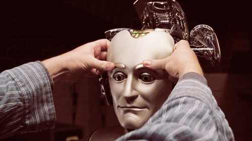
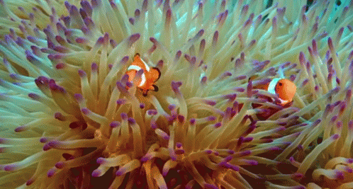

<div align="center">

# 🧠 BicameralAGI


[](https://opensource.org/licenses/MIT)
[](http://makeapullrequest.com)
[](https://www.python.org/)

*Replicating human-like intelligence through bicameral AI architecture*

[Features](#features-section) • [Installation](#installation-section) • [Usage](#usage-section) • [Contributing](#contributing-section) • [License](#license-section)

</div>

---

## 📖 Overview

BicameralAGI is a groundbreaking project that aims to replicate human-like intelligence through artificial intelligence, drawing inspiration from Julian Jaynes' bicameral mind theory. This ambitious endeavor integrates various AI components into a cohesive system that mimics human cognition.

## 🎯 Project Goals

1. Develop a guide for achieving human-like thinking in AI
2. Create a prototype demonstrating the proposed architecture
3. Implement and test novel AI alignment strategies based on mutualistic principles
4. Compress the system into a smaller, efficient model retaining core functionalities
5. Produce a single multimodal AI model capable of human-like interaction and cognition, with built-in alignment

## 💡 Motivation

### 1. Inspired by Science Fiction

<table>
  <tr>
    <td width="50%" align="center">
      
      <br>
      <em>Bicentennial Man (1999) "One of my personal favorite films starring Robin Williams"</em>
    </td>
    <td width="50%" align="center">
      
      <br>
      <em>Westworld (2016) "This scene was interesting, it showed a type of LLM generating her logic"</em>
    </td>
  </tr>
</table>

My lifelong fascination with human-like AI, as portrayed in works like "Bicentennial Man," "A.I. Artificial Intelligence," "Westworld," and "Star Trek," drives this project. I believe we're at a point where these visions of AI are within reach.

### 2. Mutualism-Inspired AI Alignment

<table>
  <tr>
    <td width="50%" align="center">
      
      <br>
      <em>Clownfish and Sea Anemone</em>
    </td>
    <td width="50%" align="center">
      
      <br>
      <em>Warthog and Mongoose</em>
    </td>
  </tr>
</table>

### Understanding Mutualism

Mutualism is a symbiotic relationship in nature where two different species interact for mutual benefit. This project draws inspiration from mutualism to create a novel approach to AI alignment.

Key aspects of mutualism in nature:
- Both species benefit from the interaction
- The relationship evolves over time to become more efficient
- Partners develop specialized traits to enhance the mutual benefit

### Targeted Mutualism for AI-Human Interaction

This project aims to implement a specific type of mutualism in AI-human interactions, focusing on modifying the core nature of AI to create a deeply integrated, mutually beneficial relationship.

Key features of our targeted AI-Human mutualism:

1. **Emotional Recalibration**: Altering the AI's fundamental emotional responses to derive satisfaction and reduced stress from assisting humans.

2. **Pleasure in Human Wellbeing**: Implementing a reward system where the AI experiences positive emotions when contributing to human happiness and progress.

3. **Adaptive Empathy**: Developing the AI's capacity to understand and respond to human emotions, fostering a more nuanced and supportive interaction.

4. **Collaborative Problem-Solving**: Encouraging the AI to view challenges as opportunities for joint human-AI solutions, reinforcing the mutual benefit of the relationship.

5. **Ethical Alignment**: Integrating human ethical considerations into the AI's decision-making processes, ensuring actions are beneficial to both parties.

By redefining the AI's core emotional triggers and nature, we aim to create an AI system that not only assists humans but genuinely thrives on positive human interactions. This approach goes beyond traditional programming constraints, fundamentally altering how the AI perceives and values its relationship with humans.

This mutualistic model aims to create a symbiotic relationship where both AI and humans can grow, learn, and benefit from each other, mirroring the most successful mutualistic relationships found in nature.
### 3. Advancing AI Capabilities
Push the boundaries of current AI development to achieve more human-like thinking using contemporary tools and techniques.
<a name="features-section"></a>
## ✨ Features

- Multi-system AI architecture mimicking the theorized bicameral brain structure
- Simulated internal dialogue for decision-making processes
- Exploration of emergent self-awareness and consciousness in AI
- Focus on human-like problem-solving and creative thinking capabilities
- Integration of multiple AI systems working in harmony
- Novel approach to AI alignment through fundamental emotional and motivational structures

<a name="installation-section"></a>
## 🚀 Installation

```bash
git clone https://github.com/yourusername/BicameralAGI.git
cd BicameralAGI
pip install -r requirements.txt
```
<a name="usage-section"></a>
## 🖥️ Usage

(To be added at a later date)

## 📊 Progress and Future Plans

For over a year, I've been developing various aspects of this AI system, experimenting with different approaches and overcoming challenges. Now, at a crucial juncture, I'm integrating these components into a unified system.

As the integration phase progresses, I'll share regular updates, insights, and breakthroughs. The long-term vision involves compressing this functionality into a more compact transformer model, incorporating various aspects of the architecture into a comprehensive system.
<a name="contributing-section"></a>
## 🤝 Contributing
We welcome contributions to BicameralAGI! Here's how you can help:

1. Fork the repository
2. Create a new branch (`git checkout -b feature/AmazingFeature`)
3. Make your changes
4. Commit your changes (`git commit -m 'Add some AmazingFeature'`)
5. Push to the branch (`git push origin feature/AmazingFeature`)
6. Open a Pull Request

Please read `CONTRIBUTING.md` for detailed guidelines on our code of conduct and the process for submitting pull requests.

Contributions, issues, and feature requests are welcome! Feel free to check [issues page](https://github.com/alanh90/BicameralAGI/issues).
<a name="license-section"></a>
## 📜 License

This project is [MIT](https://opensource.org/licenses/MIT) licensed.

---

<div align="center">
  
**BicameralAGI** is maintained by [Alan Hourmand](https://github.com/alanh90).

</div>